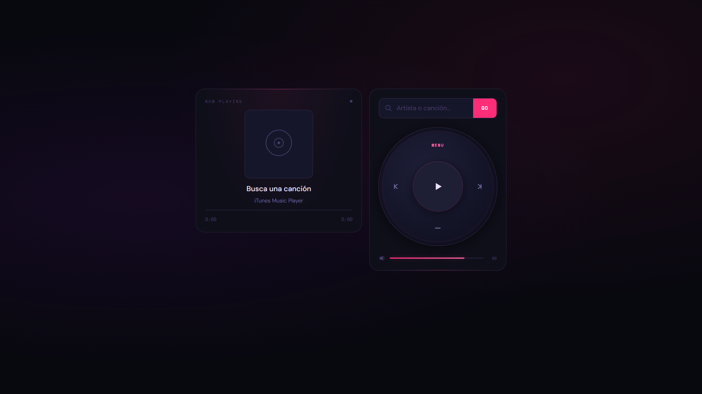
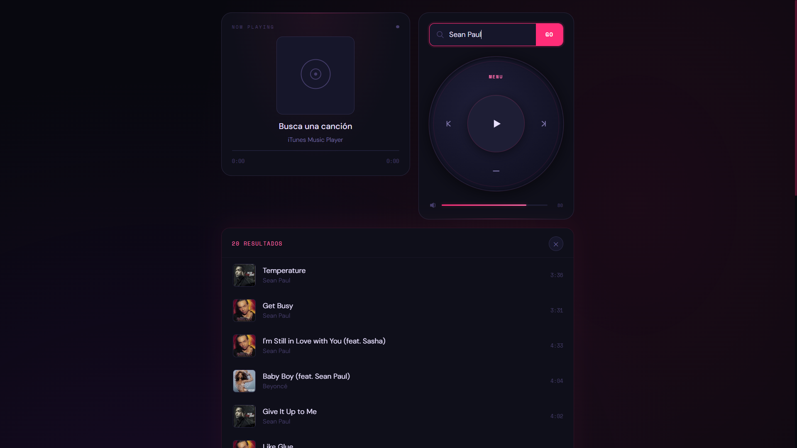
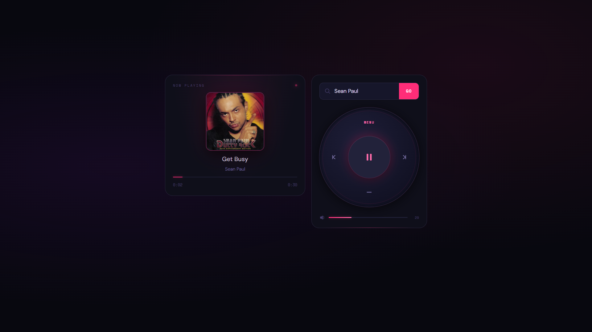
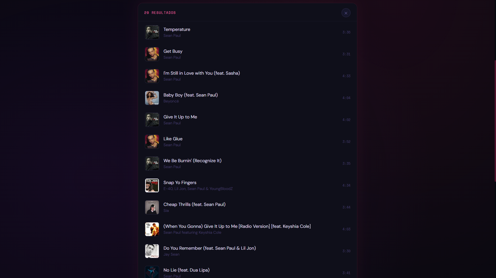

<div align="center">

# Music Player

Reproductor de música moderno, responsive y dinámico que utiliza la **iTunes Search API** para buscar canciones reales y reproducir previews al instante.

[]()
[]()
[]()
[]()
[]()
[]()

### Demo en línea

**https://music-player-wheat-omega.vercel.app/**

</div>

---

## Descripción

**Music Player** es una aplicación web desarrollada con HTML, CSS y JavaScript puro.  
Permite buscar canciones en tiempo real mediante la **iTunes Search API**, reproducir previews de audio y controlar la reproducción con una interfaz moderna, fluida e intuitiva.

---

## Características principales

| Funcionalidad         | Descripción |
|----------------------|-------------|
|    Búsqueda en vivo  | Encuentra canciones y artistas en tiempo real |
|  Reproducción      | Preview de audio instantáneo |
|  Controles         | Play / Pause / Next / Previous |
|  Progreso          | Barra interactiva de reproducción |
|  Volumen           | Control dinámico de audio |
|  Portadas          | Álbum automático desde API |
|  Teclado           | Navegación con teclado |
|  Responsive        | Adaptado a móvil, tablet y escritorio |
|  Notificaciones    | Mensajes tipo toast |
|  UI moderna        | Diseño limpio, moderno y atractivo |

---

##  Controles de teclado

| Tecla | Acción |
|------|--------|
| Espacio / K | Play / Pause |
| ← | Canción anterior |
| → | Siguiente canción |
| Enter | Buscar canción |

---
## Estructura del proyecto

```text id="e93m4k"
music-player/
│── index.html
│── style.css
│── script.js
│── README.md
│── assets/
│   └── images/
│       ├── home.png
│       ├── playing.png
│       ├── playlist.png
│       └── mobile.png
```
## Vista previa

## Dashboard principal


---

## Búsqueda de canciones


---

## Reproducción activa


---

## Lista de resultados


---

## Responsive móvil


---
## API utilizada

### iTunes Search API

API pública y gratuita utilizada para obtener música y previews de audio.

```url
https://itunes.apple.com/search
